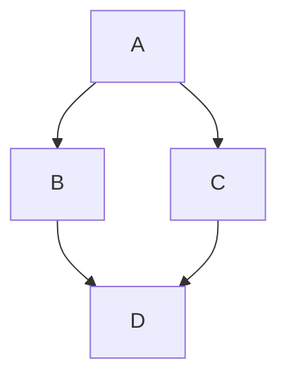

# Kitchen Sink Document {#custom-heading-id}

Here is a paragraph with a ^superscript^, a ~subscript~, and some ==highlighted text==.
Don't forget ++underlines++ and ~~strikethrough~~.
Also emojis: :smile: :rocket:

## Task Lists
- [x] Completed task
- [ ] Incomplete task

## Mathematics
Here is some inline math: $E=mc^2$.

And here is a math block:
$$
\int_0^\infty \mathrm{e}^{-x}\,\mathrm{d}x
$$

## Mermaid Diagrams

::: mermaid
sequenceDiagram
    Alice->>Bob: Hello Bob, how are you?
    Bob-->>Alice: Fine, thanks!
:::

## Footnotes
Here is a reference to a footnote.[^1]

[^1]: This is the text of the footnote.

## Definition Lists
First Term
: This is the definition of the first term.

Second Term
: This is one definition of the second term.

## Hard Breaks
This line ends with two spaces.  
This is the next line immediately below it.

### Tables
| ID | Name | Role |
| --- | --- | --- |
| 1 | Alice | Admin |
| 2 | Bob | User |
| 3 | Charlie | User |

This is raw HTML

Inline HTML works here.
