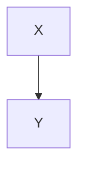

# HTML Tags Reference

This document lists every HTML element that `HtmlRenderer` can emit, what AST node type triggers it, and how the rendering is performed. Includes standard Markdown elements, multimedia embeds, LaTeX math, and Mermaid diagrams.

---

## Standard Block Elements

| AST Node Type | HTML Output | Notes |
|---|---|---|
| `document` | *(no tag)* | Renders children directly |
| `heading` | `<h1>` … `<h6>` | Level from `node['level']`. Optional `id` attribute from `node['custom_id']`. |
| `paragraph` | `<p>…</p>` | Suppressed (children rendered inline) when `tight=True` inside list items. |
| `block_quote` | `<blockquote>…</blockquote>` | Contains paragraph children. |
| `thematic_break` | `<hr />` | Self-closing. |
| `code_block` | `<pre><code class="language-X">…</code></pre>` | `class` attribute only added when `info` is non-empty. Content is HTML-escaped. Newline appended after opening tag. |
| `math_block` | `<div class="math math-display">…</div>` | Content is HTML-escaped. Intended for KaTeX / MathJax rendering. |
| `mermaid_block` | `<pre class="mermaid">…</pre>` | Content is **not** HTML-escaped (passed raw). Intended for Mermaid.js rendering. |
| `details` | `<details><summary>Title</summary><p>…</p></details>` | `title` from `node['title']` (defaults to `"Details"`). Inner content wrapped in `<p>`. |
| `html_block` | *(raw literal)* | Raw HTML passed through verbatim, no escaping. |
| `footnote_def` | `<div class="footnote" id="fn:label">…</div>` | First paragraph child rendered with `<strong>[label]:</strong>` prefix. |
| `def_list` | `<dl>…</dl>` | Contains `def_term` and `def_item` children. |
| `def_term` | `<dt>…</dt>` | Term from converted paragraph. |
| `def_item` | `<dd>…</dd>` | Definition content. |

---

## List Elements

| AST Node Type | HTML Output | Notes |
|---|---|---|
| `list` (bullet) | `<ul>…</ul>` | `list_type == 'bullet'` |
| `list` (ordered) | `<ol>…</ol>` | `list_type == 'ordered'` |
| `item` | `<li>…</li>` | Children rendered with `tight=True` to suppress `<p>` wrappers. |

---

## Table Elements

| AST Node Type | HTML Output | Notes |
|---|---|---|
| `table` | `<table><thead>…</thead><tbody>…</tbody></table>` | Rows with `table_header` children go in `<thead>`; remaining rows in `<tbody>`. |
| `table_row` | `<tr>…</tr>` | |
| `table_header` | `<th>…</th>` | Children rendered with `tight=True`. |
| `table_cell` | `<td>…</td>` | Children rendered with `tight=True`. |

---

## Inline Elements

| AST Node Type | HTML Output | Notes |
|---|---|---|
| `text` | *(HTML-escaped literal)* | `node['literal']` is passed through `escape()`. |
| `strong` | `<strong>…</strong>` | Children rendered recursively. |
| `emph` | `<em>…</em>` | Children rendered recursively. |
| `mark` | `<mark>…</mark>` | Children rendered recursively. |
| `u` | `<u>…</u>` | Underline. Children rendered recursively. |
| `del` | `<s>…</s>` | Strikethrough. Children rendered recursively. |
| `sub` | `<sub>…</sub>` | Subscript. Children rendered recursively. |
| `sup` | `<sup>…</sup>` | Superscript. Children rendered recursively. |
| `code` | `<code>…</code>` | `node['literal']` HTML-escaped. |
| `math_inline` | `<span class="math math-inline">…</span>` | `node['literal']` HTML-escaped. Intended for KaTeX / MathJax. |
| `link` | `<a href="dest">…</a>` | `dest` HTML-escaped. `javascript:` destinations are stripped to empty string as a security measure. Children rendered recursively (link label). |
| `footnote_ref` | `<sup><a href="#fn:label">^label</a></sup>` | Links to the footnote definition anchor. |
| `emoji` | *(HTML-escaped literal)* | Emoji shortcode value passed through `escape()`. |
| `task_checkbox` | `<input type="checkbox" disabled>` or `<input type="checkbox" disabled checked>` | `checked` attribute added when `node['checked']` is True. |
| `hardbreak` | `<br />\n` | Triggered by two trailing spaces before a newline. |
| `softbreak` | `<br />\n` | Triggered by a bare newline in inline content. |
| `html_inline` | *(raw literal)* | Inline HTML tag passed through verbatim. |

---

## Multimedia Elements

### Image

**Syntax:** ``

**AST node type:** `image`

**HTML output:**
```html

```

- `src` is the `destination` field, HTML-escaped.
- `alt` is extracted by `_text_content(node)` — a recursive plain-text extraction of all child nodes — then HTML-escaped. This handles nested formatting inside the alt text (e.g., ``).
- No closing tag; self-closing element.

---

### Video

**Syntax:** `@[My Caption](https://example.com/video.mp4)`

**AST node type:** `video`

**HTML output:**
```html
<video controls>
  <source src="https://example.com/video.mp4" />
  My Caption
</video>
```

- `src` is HTML-escaped `destination`.
- Caption (HTML-escaped `title`) is rendered as a text line inside `<video>` if non-empty. Browsers that support `<video>` will ignore the text; others display it as fallback.

---

### Audio

**Syntax:** `&[My Sound](https://example.com/audio.mp3)`

**AST node type:** `audio`

**HTML output:**
```html
<audio controls>
  <source src="https://example.com/audio.mp3" />
  My Sound
</audio>
```

- Same structure as video but uses `<audio>` tag.

---

## Math Rendering

pyV does **not** render LaTeX itself. It emits semantic HTML that is intended to be picked up by a client-side math renderer such as **KaTeX** or **MathJax**.

### Inline Math

**Syntax:** `$E = mc^2$`

**AST node type:** `math_inline`

**HTML output:**
```html
<span class="math math-inline">E = mc^2</span>
```

- The LaTeX source is HTML-escaped before insertion.
- KaTeX auto-render or MathJax will find elements with class `math math-inline` and render them.

---

### Block Math

**Syntax:**
```
$$
\int_0^\infty e^{-x^2} dx = \frac{\sqrt{\pi}}{2}
$$
```

**AST node type:** `math_block`

**HTML output:**
```html
<div class="math math-display">
\int_0^\infty e^{-x^2} dx = \frac{\sqrt{\pi}}{2}
</div>
```

- The LaTeX source is HTML-escaped.
- KaTeX / MathJax targets elements with class `math math-display`.

---

## Mermaid Diagrams

pyV does **not** render Mermaid diagrams itself. It emits a `<pre class="mermaid">` block that **Mermaid.js** will pick up and replace with an SVG.

### Syntax — Colon-fence style

```
:::mermaid
graph LR
    A --> B
:::
```

### Syntax — Backtick-fence style

````

````

**AST node type:** `mermaid_block`

**HTML output:**
```html
<pre class="mermaid">
graph LR
    A --> B
</pre>
```

- Content is passed through **without HTML escaping** so Mermaid.js receives the raw diagram source.
- Add `<script src="https://cdn.jsdelivr.net/npm/mermaid/dist/mermaid.min.js"></script>` to `template.html` to activate rendering.

---

## HTML Escaping

The `escape()` method is applied to all text content and attribute values before insertion. The escaping table:

| Character | Escaped form |
|---|---|
| `&` | `&amp;` |
| `<` | `&lt;` |
| `>` | `&gt;` |
| `"` | `&quot;` |
| `'` | `&#x27;` |

**Security note:** Link `href` attributes whose escaped value starts with `javascript:` are replaced with an empty string, preventing XSS via `javascript:` URLs.

Raw HTML blocks (`html_block`, `html_inline`) are **never** escaped — they are passed through verbatim.
