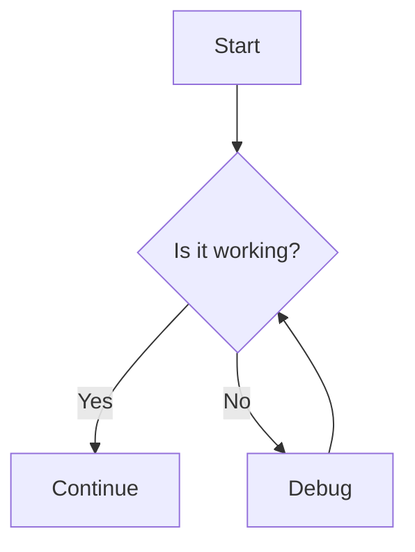
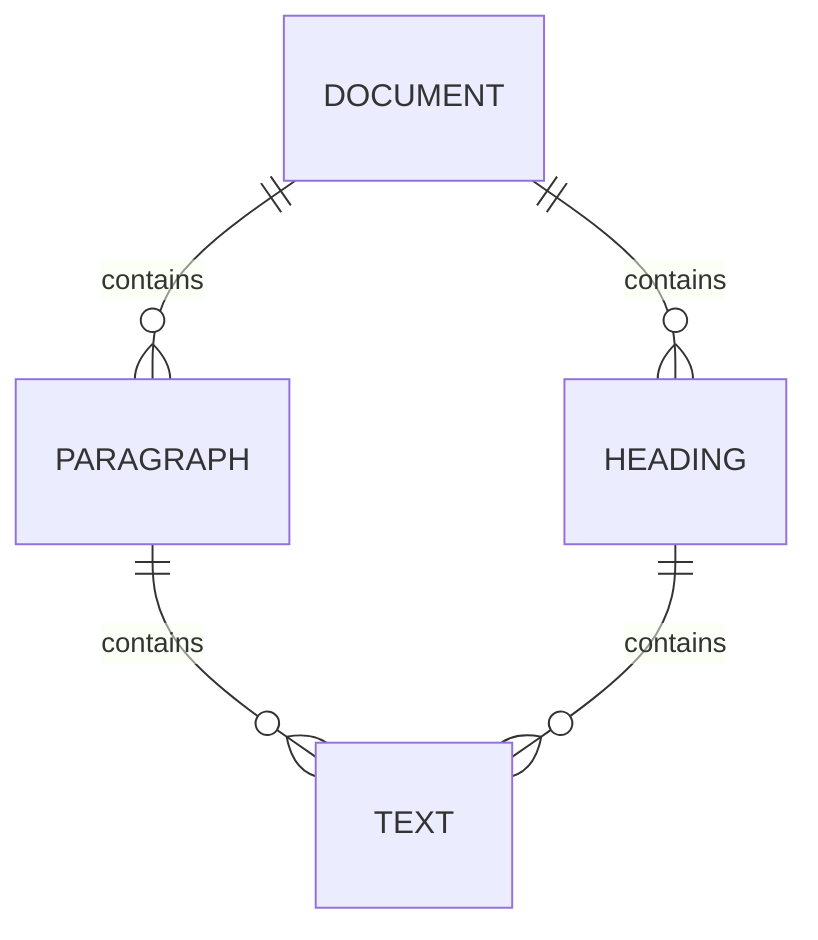

# Mini_Compiler Comprehensive Test Document

This file exercises every block-level and inline-level feature of the Mini_Compiler Markdown compiler. Components are intentionally mixed in random order. Multimedia links point to real, publicly accessible resources.

---

> "The best way to understand a system is to push it to its limits."
> — Anonymous

---

## Task Lists

- [x] Set up the repository
- [ ] Write the lexer
- [x] Write the parser
- [ ] Deploy to production
- [x] Write the documentation

---

Here is some ==highlighted text== and some ++underlined text++ appearing mid-paragraph. The temperature is 100^∘^C and the chemical formula is H~2~O.

---

:::mermaid
sequenceDiagram
    participant User
    participant Compiler
    User->>Compiler: markdown input
    Compiler->>Compiler: tokenize()
    Compiler->>Compiler: parse()
    Compiler->>User: HTML output
:::

---

A definition list example:

Python
: A high-level, general-purpose programming language.

JavaScript
: A lightweight, interpreted scripting language.

Rust
: A systems programming language focused on safety and performance.

---

1. First ordered item
2. Second ordered item
3. Third ordered item with **bold** and _italic_ content
4. Fourth item with `inline code`

---

&[Ocean Waves](https://www.soundhelix.com/examples/mp3/SoundHelix-Song-1.mp3)

---

> Nested blockquote:
> You can have **bold**, _italic_, and even `code` inside a blockquote.

---

```python
def greet(name: str) -> str:
    return f"Hello, {name}!"

print(greet("World"))
```

---

Inline math works like this: the famous identity is $e^{i\pi} + 1 = 0$.

Superscript: Einstein's $E = mc^2$ and Pythagorean theorem $a^2 + b^2 = c^2$.

---

| Language | Paradigm | Typing |
|---|---|---|
| Python | Multi-paradigm | Dynamic |
| Haskell | Functional | Static |
| C++ | Multi-paradigm | Static |
| JavaScript | Multi-paradigm | Dynamic |

---


---

Here is a footnote reference[^1] and another one[^note] in a paragraph.

[^1]: This is the first footnote definition with **bold** and _italic_ content.
[^note]: This is the second footnote, referenced by a word label.

---

- Nested bullet list:
  - Level 2 item A
  - Level 2 item B
    - Level 3 item i
    - Level 3 item ii
  - Level 2 item C
- Back to level 1

---

$$
\nabla \cdot \mathbf{E} = \frac{\rho}{\varepsilon_0}
$$

---

@[Big Buck Bunny](https://www.w3schools.com/html/mov_bbb.mp4)

---

An escaped asterisk: \* and an escaped backtick: \`. Using HTML entity: &copy; and &mdash;.

---

:::details Advanced Configuration

This section explains advanced options. You can include **rich content** here.

- Option A: fast mode
- Option B: verbose mode

:::

---

Some text with a hard line break here  
and the next line continues after the break.

---

> Second blockquote block.
> This one has ==highlighted== text and a link: [OpenAI](https://openai.com).

---



---

| Feature | Supported | Notes |
|---|---|---|
| Tables | ✓ | Pipe-delimited |
| Math | ✓ | KaTeX / MathJax |
| Mermaid | ✓ | Mermaid.js |
| Footnotes | ✓ | Referenced by label |

---

Visit the official site at <https://www.python.org> or contact support at <help@example.com>.

---

~~Strikethrough text~~ is rendered as `<s>`. So is ~~this entire phrase~~.

---

$$
\sum_{n=1}^{\infty} \frac{1}{n^2} = \frac{\pi^2}{6}
$$

---

Here is a [Wikipedia link](https://en.wikipedia.org/wiki/Markdown) and another [GitHub](https://github.com) link.

---

- [ ] Unchecked task item
- [x] Checked task item — done
- [ ] Another pending item
- [x] Completed item two

---

:::mermaid
pie title Browser Market Share 2024
    "Chrome" : 65
    "Safari" : 18
    "Firefox" : 4
    "Edge" : 4
    "Other" : 9
:::

---

The subscript formula for water: H~2~O and for carbon dioxide: CO~2~. In superscript: x^2^ + y^2^ = r^2^.

---

```javascript
const parser = new Parser();
const ast = parser.parse(markdownText);
const renderer = new HtmlRenderer();
const html = renderer.render(ast.to_dict());
console.log(html);
```

---


---

&[Test Audio Track](https://www.soundhelix.com/examples/mp3/SoundHelix-Song-2.mp3)

---

A paragraph with multiple inline elements: **bold**, _italic_, ==highlighted==, ++underlined++, ~~strikethrough~~, ~subscript~, ^superscript^, `code`, $math$, :smile:, [a link](https://example.com), and an emoji :rocket:.

---

| Name | Score | Grade |
|---|---|---|
| Alice | 95 | A |
| Bob | 82 | B |
| Charlie | 71 | C |

---

```
Plain text fenced block without a language tag.
No syntax highlighting class will be applied.
    Indentation is preserved exactly.
```

---

Autolinks: <https://www.wikipedia.org> and email <contact@example.org>.

---

:::details Mermaid Inside Details

The following diagram shows a simple flowchart embedded inside a details block.

:::

---

1. Ordered list restart
2. With an image inside an item:


3. And `inline code` in an item
4. And **bold** in another

---

$$
\int_{-\infty}^{+\infty} e^{-x^2} dx = \sqrt{\pi}
$$

---

> Third blockquote.
> It contains a nested list:
> - alpha
> - beta
> - gamma

---

@[Sample Video](https://www.w3schools.com/html/movie.mp4)

---

Definition list second example:

Lexer
: Converts raw text into a flat stream of tokens.

Parser
: Consumes the token stream and builds an AST.

Renderer
: Walks the AST and emits the target output format.

---

A paragraph with HTML entity references: &lt;angle brackets&gt;, &amp;ampersand&amp;, and numeric entity &#9829; (heart).

---



---

- Another bullet list
- With **bold** items
- And _italic_ items
- And a [link](https://developer.mozilla.org) inside a list item
- And ~~strikethrough~~ inside a list item

---

&[Background Music](https://www.soundhelix.com/examples/mp3/SoundHelix-Song-3.mp3)

---

An escaped backslash: \\ and an escaped hash: \#. Inline HTML: <span style="color:red">red text</span>.

---

## Heading with Custom ID {#custom-anchor}

This heading has a custom anchor `{#custom-anchor}` that renders as `id="custom-anchor"` on the `<h2>` element.

---

| Col 1 | Col 2 | Col 3 |
|---|---|---|
| Row 1 A | Row 1 B | Row 1 C |
| Row 2 A | Row 2 B | Row 2 C |
| Row 3 A | Row 3 B | Row 3 C |

---

Here is a reference to footnote[^alpha] and another[^beta] in a single paragraph to test multiple footnote refs.

[^alpha]: Alpha footnote — explains the first concept.
[^beta]: Beta footnote — explains the second concept with `code` and **bold**.

---

$$
\frac{d}{dx}\left[\int_a^x f(t)\,dt\right] = f(x)
$$

---

:::mermaid
classDiagram
    class Lexer {
        +tokenize(text) list
        +tokenize_inline(text) list
        -_classify_inline(token) str
        -_inline_meta(type, token) dict
    }
    class Parser {
        +parse(text) Node
        -_incorporate_token(tok)
        -process_inlines(doc)
    }
    class HtmlRenderer {
        +render(ir_dict) str
        -_render_node(node)
        -escape(text) str
    }
    Lexer --> Parser
    Parser --> HtmlRenderer
:::

---


---

*End of test document.*
